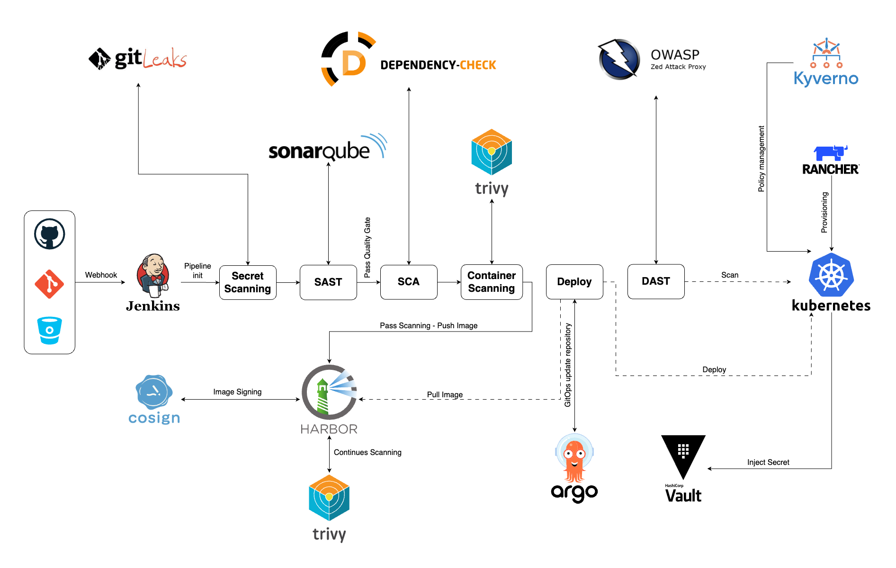

# DevSecOps Project

Welcome to my DevSecOps platform project! This platform combines several open source and cloud-native tools to create a comprehensive environment for practicing DevSecOps skills.

The codebase is forked from Google's [microservices-demo](https://github.com/GoogleCloudPlatform/microservices-demo) and includes several different programming languages. This allows me to gain hands-on experience with building Docker images and managing dependencies in a realistic microservices architecture.

Through this project, I aim to deepen my understanding of DevSecOps best practices, strengthen my skills with relevant tools and technologies, and create a solid portfolio piece demonstrating my capabilities. I'm excited to continue developing this platform and exploring the possibilities at the intersection of development, security, and operations.

## Architecture Diagram

## Tools

+ Secret Scanning - GitLeaks
+ Static Application Security Testing (SAST) - SonarQube
+ Software Composition Analysis (SCA) - OWASP Dependency-check 
+ Container Scanning - Trivy
+ Dynamic Application Security Testing (DAST) - OWASP ZAP
+ Secret Management - Vault
+ Provisioning - Rancher
+ Registry - Harbor

## Source Code