# DevSecOps Project

Welcome to my DevSecOps platform project! This platform combines several open source and cloud-native tools to create a comprehensive environment for practicing DevSecOps skills.

The codebase is forked from Google's [microservices-demo](https://github.com/GoogleCloudPlatform/microservices-demo). This allows me to gain hands-on experience with building Docker images and managing dependencies in a realistic microservices architecture.

Through this project, I aim to deepen my understanding of DevSecOps best practices which I following in [OWASP-DevSecOpsGuideline](https://github.com/OWASP/DevSecOpsGuideline), strengthen my skills with relevant tools and technologies, and create a solid portfolio piece demonstrating my capabilities. I'm excited to continue developing this platform and exploring the possibilities at the intersection of development, security, and operations.

## Pipeline Architecture Diagram

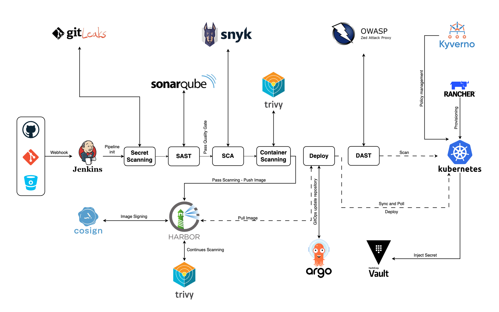

## Tools

+ `GitLeaks` - Secret Scanning
+ `SonarQube` - Static Application Security Testing (SAST)
+ `Snyk` - Software Composition Analysis (SCA)
+ `Trivy` - Container Scanning
+ `ZAP` - Dynamic Application Security Testing (DAST)
+ `Vault` - Secret Management
+ `Rancher` - K8s Provisioning
+ `Harbor` - Docker image registry and continues image scanning with Trivy
+ `ArgoCD` - GitOps for sync/poll Manifest and K8s Cluster
+ `Cosign` - Sign container images with digital signature
+ `Kyverno` - Kubernetes Native Policy Management

##### Apendix.

`SCA` (Software Composition Analysis) scans and identifies vulnerabilities in open-source libraries and dependencies used in a project.

`SAST` (Static Application Security Testing) analyzes the source code or compiled code of an application to identify potential security vulnerabilities without executing the code.

`DAST` (Dynamic Application Security Testing) tests a running application by simulating attacks and identifying vulnerabilities in the application's behavior and responses.

## Microservices Architecture

All in this [Microservices details](https://github.com/DarNattp/demo)

## Provisioning K8s HA Cluster with Rancher Kubernetes Engine

I have already created an High Availability Kubernetes cluster using `Rancher` by following the instructions provided in this link: [That DevOps Guy](https://youtu.be/1j5lhDzlFUM?si=MZ0Oaqsg2f58J7EB)

```sh
NAME       STATUS   ROLES               AGE   VERSION
master-1   Ready    controlplane,etcd   98d   v1.28.9
master-2   Ready    controlplane,etcd   97d   v1.28.9
master-3   Ready    controlplane,etcd   97d   v1.28.9
worker-1   Ready    worker              97d   v1.28.9
worker-2   Ready    worker              97d   v1.28.9
worker-3   Ready    worker              97d   v1.28.9
```

## DevSecOps Pipeline stages detail

I will explain for importance stages and example groovy code on below.

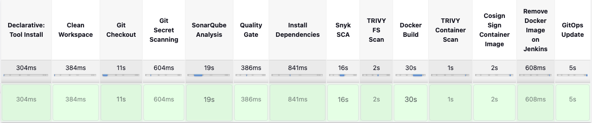

### Git Secret Scanning

In the `Git Secret Scanning` stage, the pipeline uses a tool called "gitleaks" that I installed in Jenkins server and use to scan the Git repository for any sensitive information or secrets that may have been accidentally committed. Then generate report and keep this artifact for review. 

Here's how the code works in this stage

```sh
stage("Git Secret Scanning"){
    steps{
        sh """ gitleaks detect --verbose --report-path=gitleaks_report.json """
    }
}
```

example output

```sh
[
  {
    "line": "const apiKey = 'abc123def456ghi789jkl012mno345';",
    "lineNumber": 42,
    "offender": "abc123def456ghi789jkl012mno345",
    "commit": "1a2b3c4d5e6f7g8h9i0j1k2l3m4n5o6p7q8r9s0t",
    "repo": "https://github.com/example/repo.git",
    "rule": "Generic API Key",
    "commitMessage": "Add API key for external service integration",
    "author": "John Doe",
    "email": "johndoe@example.com",
    "file": "src/config.js",
    "date": "2023-05-16T10:30:00Z",
    "tags": "key, API"
  }
]
```

### SonarQube Analysis

This stage performs performs static code analysis using SonarQube to assess code quality and identify potential issues.

the `withSonarQubeEnv` function is used to set up the SonarQube environment based on the `sonar-server` configuration. The `sh` step runs the SonarQube scanner command, passing the project name and project key as parameters.

```sh
stage('SonarQube Analysis') {
    environment {
        SCANNER_HOME = tool 'sonar-scanner'
    }
    steps {
      withSonarQubeEnv('sonar-server') {
        sh """ $SCANNER_HOME/bin/sonar-scanner \
        -Dsonar.projectName=${SONAR_PROJECT_KEY} \
        -Dsonar.projectKey=${SONAR_PROJECT_KEY} """
      }
    }
}
```

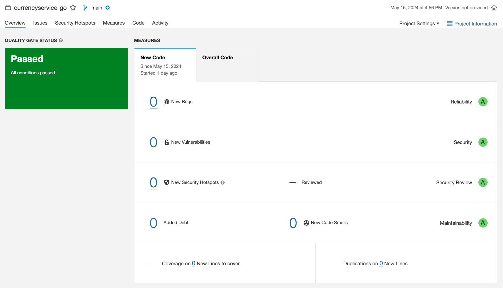

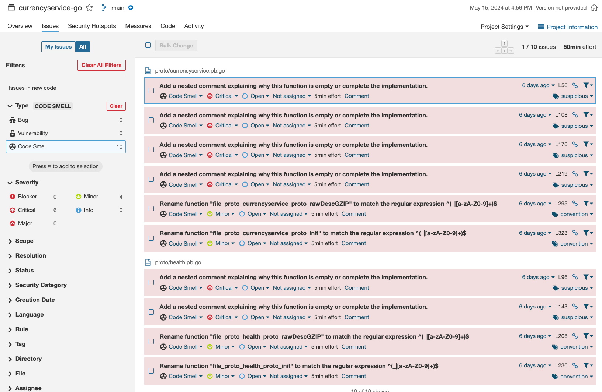

### Quality Gate

This stage will wait for the SonarQube quality gate to pass before proceeding to the next stage.

We can configure a custom quality gate with specific conditions and criteria.

```sh
stage("Quality Gate"){
  steps {
        script {
            waitForQualityGate abortPipeline: true, credentialsId: 'sonar-token'
        }
    } 
}
```

### Install Dependencies

Installs the required dependencies for the Go application using "go mod tidy".

```sh
stage('Install Dependencies') {
    steps {
        sh "go mod tidy"
    }
}
```

### Snyk SCA

Snyk is used to scan the Go project's dependencies and libraries for known vulnerabilities. It checks the project's dependency tree against Snyk's vulnerability database to identify any security issues in the third-party packages used by the project.

```sh
stage('Snyk SCA') {
  steps {
    retry(3) {
    echo 'Testing...'
    snykSecurity(
      snykInstallation: 'snyk@latest',
      snykTokenId: 'snyk-api-token',
      failOnIssues: false ,
      additionalArguments: '--all-projects --detection-depth=4'
    )
    }
  }
}
```

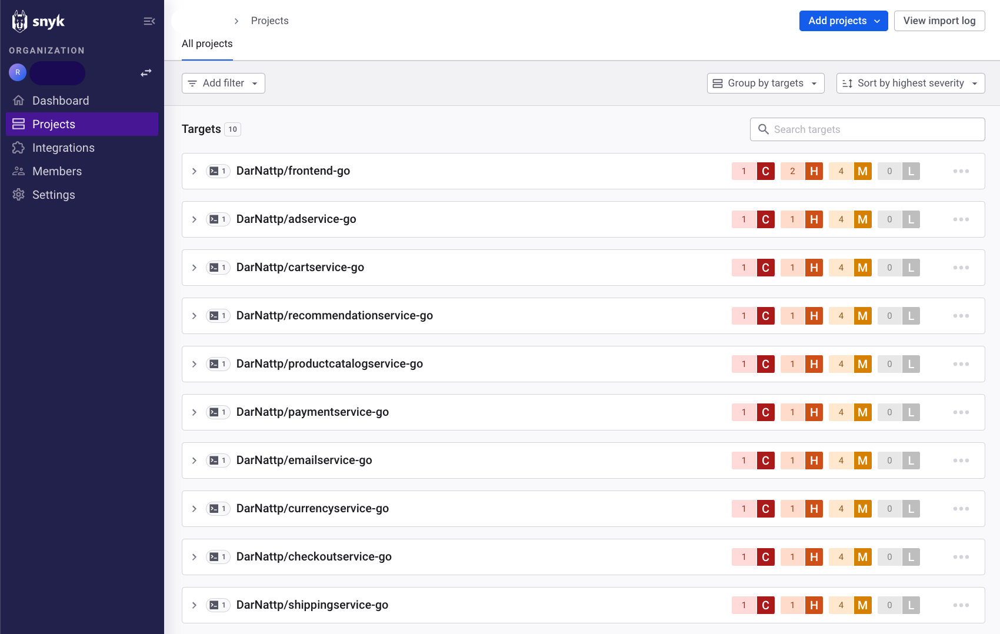

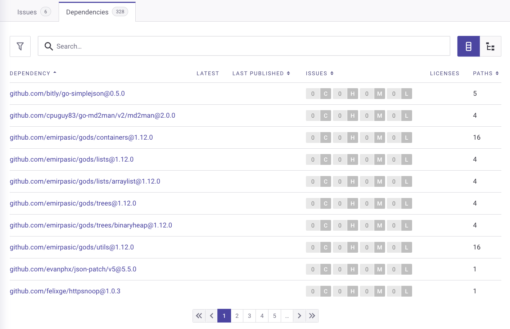

##### And able to integrate with Jenkins.

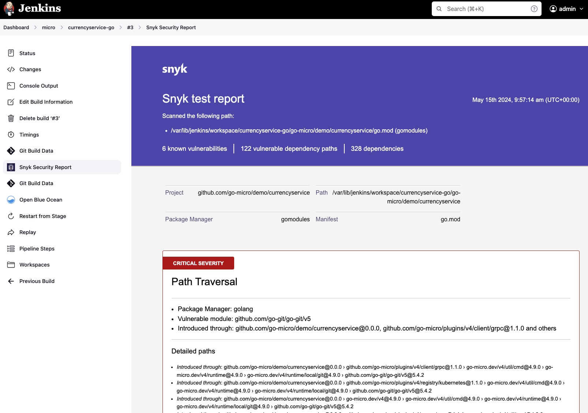

### TRIVY FS Scan

Scans the filesystem using Trivy to detect any security issues.

```sh
stage('TRIVY FS Scan') {
    steps {
        sh "trivy fs . > trivyfs.txt"
    }
}
```

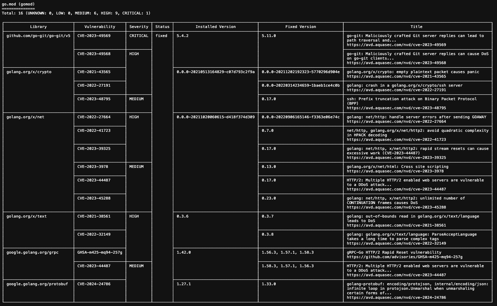

### Docker Build (and also Push)

Builds a Docker image of the application and pushes it to a Harbor registry.

```sh
stage("Docker Build"){
    steps{
        script{
            withDockerRegistry(credentialsId: 'harbor-pwd', toolName: 'docker', url: 'https://${HARBOR_URL}') {   
                sh "docker build . -t ${HARBOR_TAG}"
                sh "docker push ${HARBOR_TAG}"
            }
        }
    }
}
```

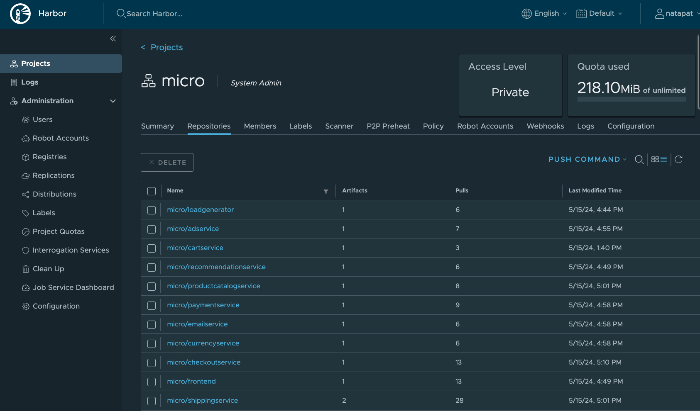

##### And continues scan with Trivy build in Harbor.

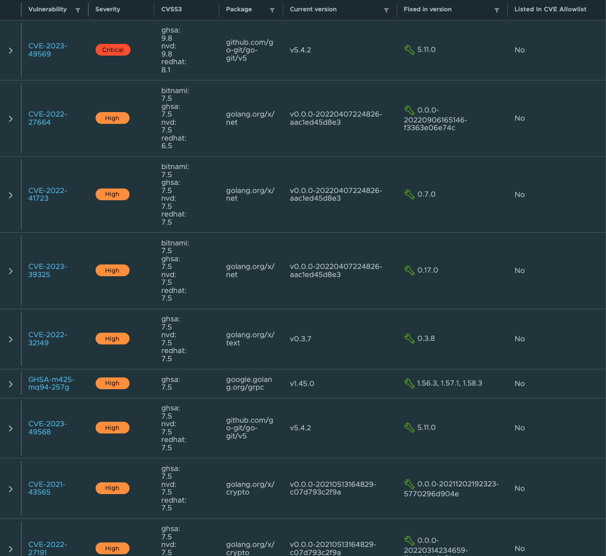

### TRIVY Container

Scans the built Docker image using Trivy to identify any vulnerabilities and keep artifact.

```sh
stage("TRIVY Container Scan"){
    steps{
        sh "trivy image ${HARBOR_TAG} > trivyimage.txt" 
    }
}
```

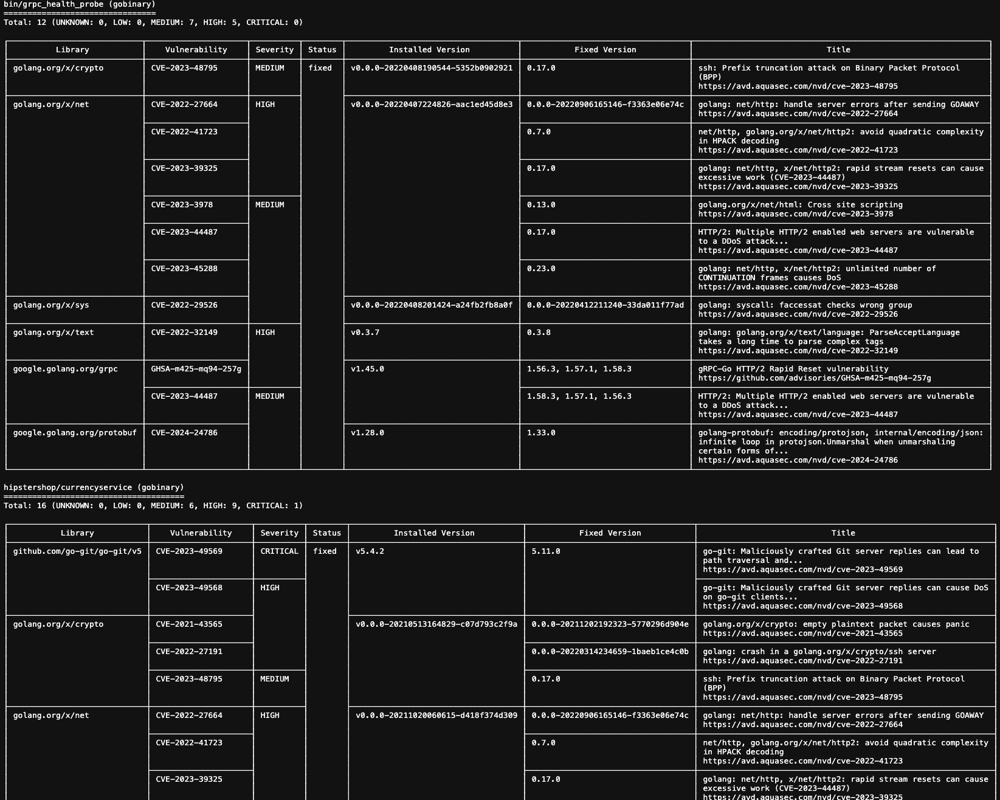

### Cosign Sign Container Image

Signs the Docker image using Cosign to ensure its integrity and authenticity.

```sh
stage('Cosign Sign Container Image') {
  steps {
      script{
            withDockerRegistry(credentialsId: 'harbor-pwd', toolName: 'docker', url: 'https://${HARBOR_URL}') {   
                sh 'cosign version'
                sh 'cosign sign --key $COSIGN_PRIVATE_KEY ${HARBOR_TAG}'
            }
        }
    }
}
```

### GitOps Update Manifest

I create gitOpsUpdate function for update tag in git repository and call it in this stage. I still create `Discord` notification function when this stage has fail.

After completely update tag, `ArgoCD` will sync and poll to deploy to K8s cluster.

```sh
def gitOpsUpdate() {
    git (url: GITOPS_URL,credentialsId: CREDENTIALS_ID,branch: GITOPS_BRANCH)
    sh 'git config --global user.email "${USERNAME}@jenkins.com"'
    sh 'git config --global user.name "${USERNAME}"'
    sh "sed -i -e 's+${HARBOR_URL}/${PROJECT_NAME}/${API_NAME}:.*+${HARBOR_URL}/${PROJECT_NAME}/${API_NAME}:${BUILD_NUMBER}+g' ${DEPLOYMENT_FILE}"
    sh "git add ${DEPLOYMENT_FILE}"
    sh "git commit -m 'we're updating the deployment ${HARBOR_TAG}' || true"
    sh "git push https://github.com/DarNattp/gitops.git HEAD:main"
}
stage('GitOps Update Manifest') {
    steps {
        script {
            def retryCount = 0
            def maxRetry = 3
            while (retryCount < maxRetries) {
                try {
                    gitOpsUpdate()
                    break
                } catch (Exception e) {
                    if (retryCount < maxRetries) {
                        retryCount++
                        echo "Build failed, we're retrying GitOps update for (${retryCount}/${maxRetry)"
                        gitOpsUpdateStage()
                    } else {
                        sendDiscordNoti(STAGE_NAME, e.getMessage())
                        throw e
                    }
                }
            }
        }
    }
}
```

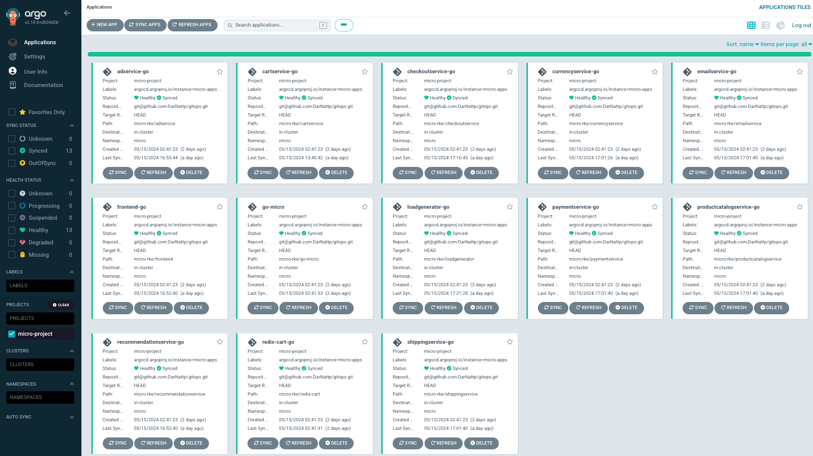

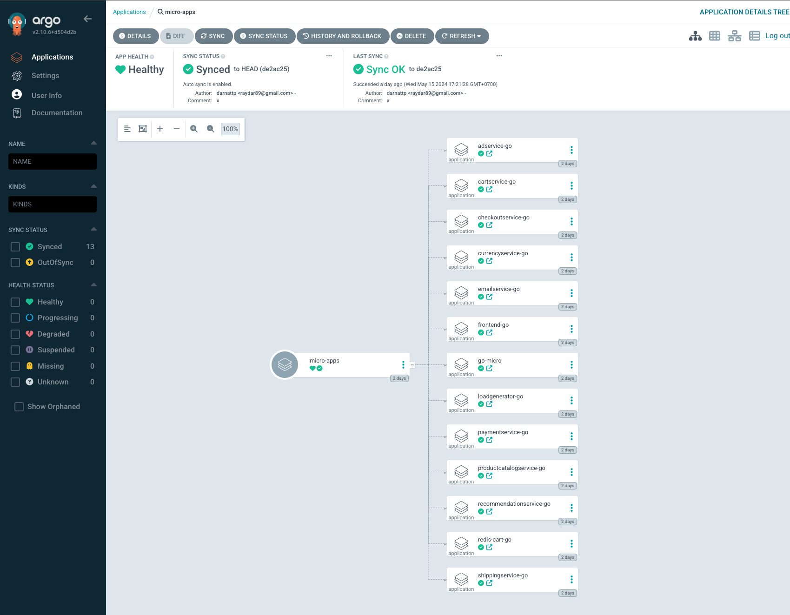

## ZAP

I used `ZAP` baseline scan is an automated scan that uses the web spider to navigate through the application and a pre-defined set of tests to quickly identify common web application vulnerabilities, such as SQL injection, cross-site scripting (XSS), and other security issues. And generate artifact at last.

```sh
stages {
    stage('clean workspace'){
        steps{
            cleanWs()
        }
    }
    
    stage('ZAP Baseline Scan') {
        steps {
            sh '''
            chmod 777 -R $PWD
            docker run --rm -v $(pwd)/:/zap/wrk/:rw -t ghcr.io/zaproxy/zaproxy:weekly zap-baseline.py -t ${TARGET_URL} -I -r zap_scan_report.html
            '''
        }
    }

    stage('Publish Reports') {
        steps {
            publishHTML([
                allowMissing: false,
                alwaysLinkToLastBuild: true,
                keepAll: true,
                reportDir: './',
                reportFiles: 'zap_scan_report.html',
                reportName: 'ZAP Scan Reports',
                reportTitles: 'Baseline Scan, Full Scan'
            ])
        }
    }
}
```

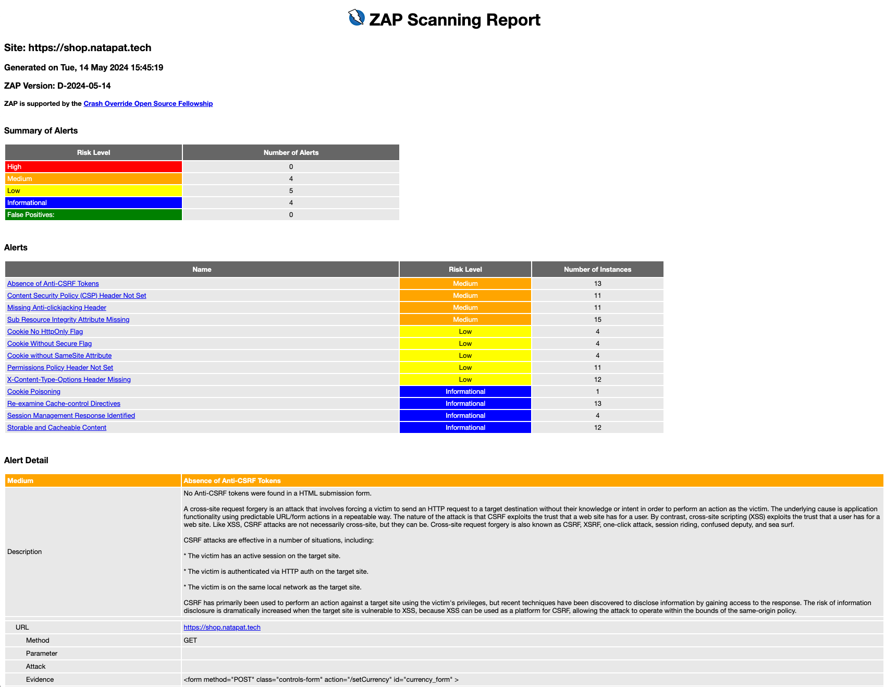

## Kyverno

Kyverno is an open-source Kubernetes native policy engine that allows you to validate, mutate, and generate configurations for your Kubernetes resources using custom policies written in YAML or JSON.

Kyverno will integrate with Kubernetes admission controllers to enforce policies and validate, mutate, or generate Kubernetes resource configurations before they are persisted in the cluster's etcd database.

You can install CRD `Kyverno` as Helm and config the policy in YAML

```sh
helm install kyverno-policies kyverno/kyverno-policies -n kyverno
```

```sh
apiVersion: kyverno.io/v1
kind: ClusterPolicy
metadata:
  name: cosign-verify-image-signature
  annotations:
    policies.kyverno.io/title: Verify Image Signature
    policies.kyverno.io/category: Software Supply Chain Security
    policies.kyverno.io/severity: medium
    policies.kyverno.io/subject: Pod
    policies.kyverno.io/minversion: 1.7.0
    policies.kyverno.io/description: >-
      This policy checks the signature of the image 
      harbor.natapat.tech/micro/image_name in the test-cosign namespace
      to ensure it has been signed by Cosign with the provided public key.
spec:
  validationFailureAction: enforce
  background: false
  rules:
  - name: cosign-verify-image-signature
    match:
      resources:
        kinds:
        - Pod
        namespaces:
        - micro
    verifyImages:
    - imageReferences:
      - "harbor.natapat.tech/micro/*:*"
      mutateDigest: true
      attestors:
      - entries:
        - keys:
            publicKeys: |-
              -----BEGIN PUBLIC KEY-----
              MFkwEwYHKoZIzj0AQYIKoZIzj0DAQcDQgAEGaBiPzxPv4q11N2B9itdFakyBpMmM
              Vc0Ra5QFpEjU+vx97TGqOt+uP+s+zpTruxper5vRr5lerWrAxD8NCRY3Ow==
              -----END PUBLIC KEY-----
```